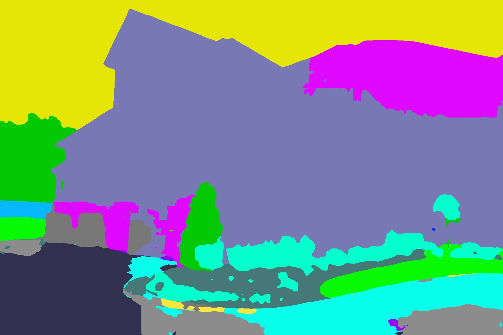
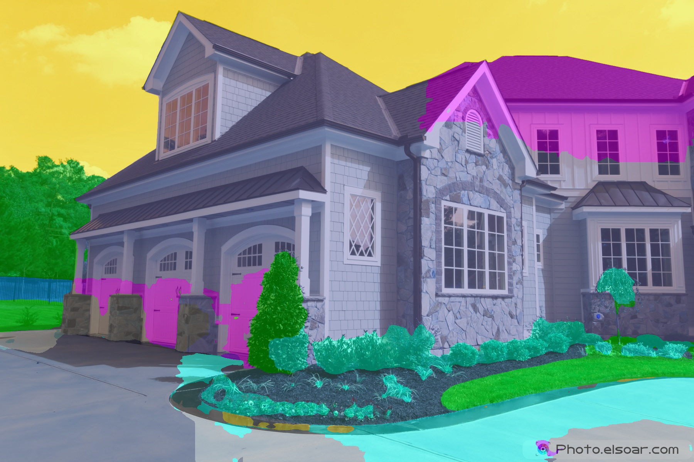
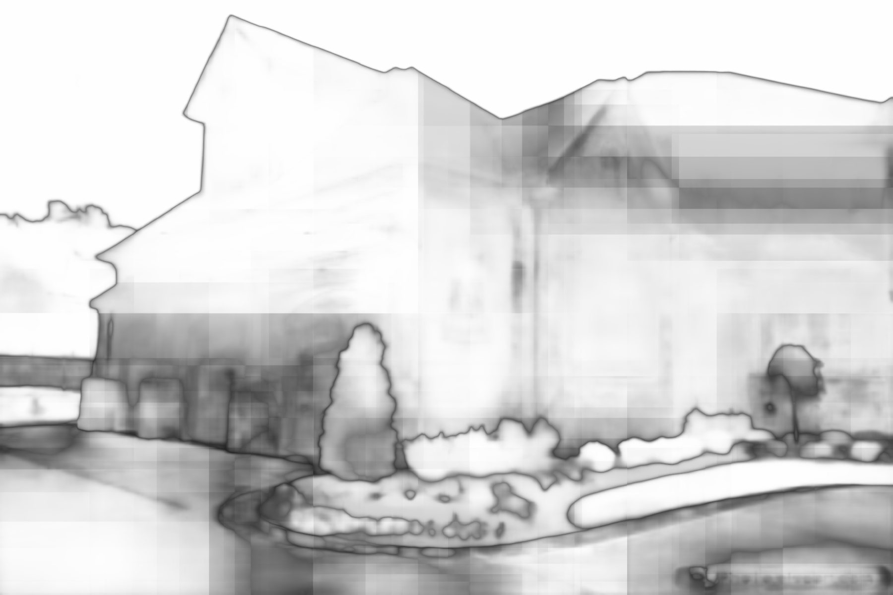
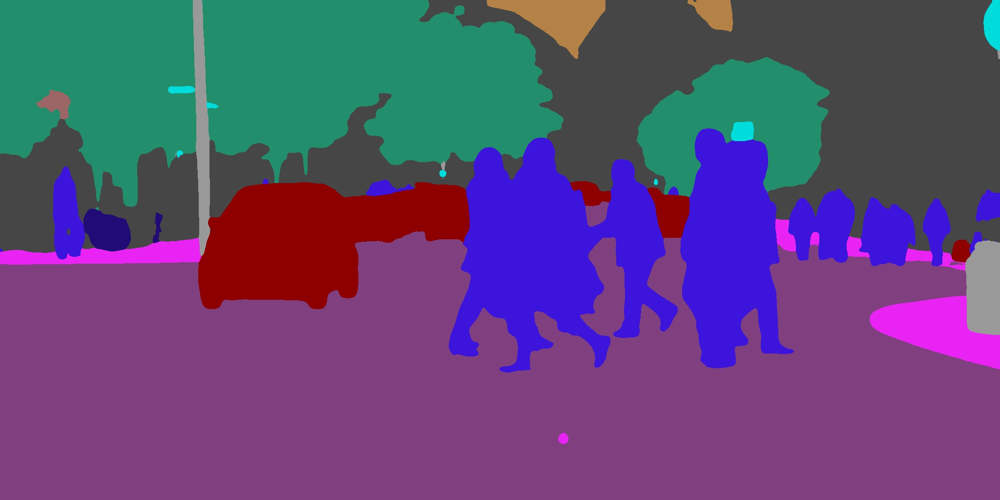
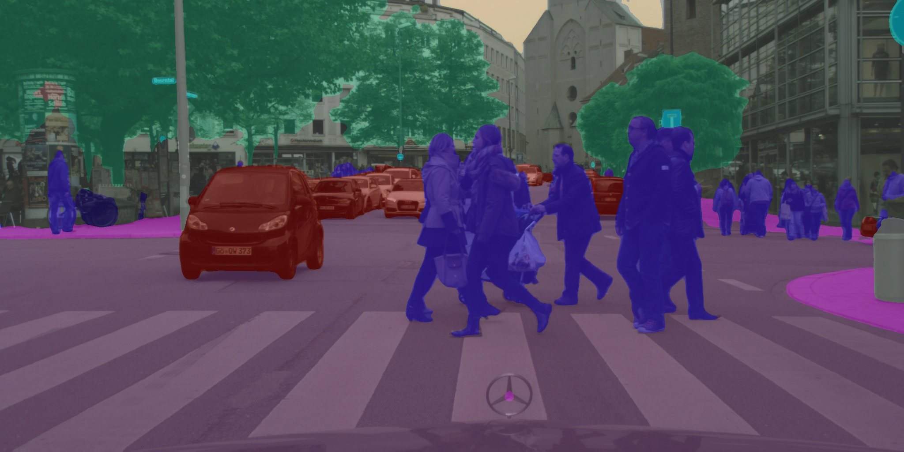
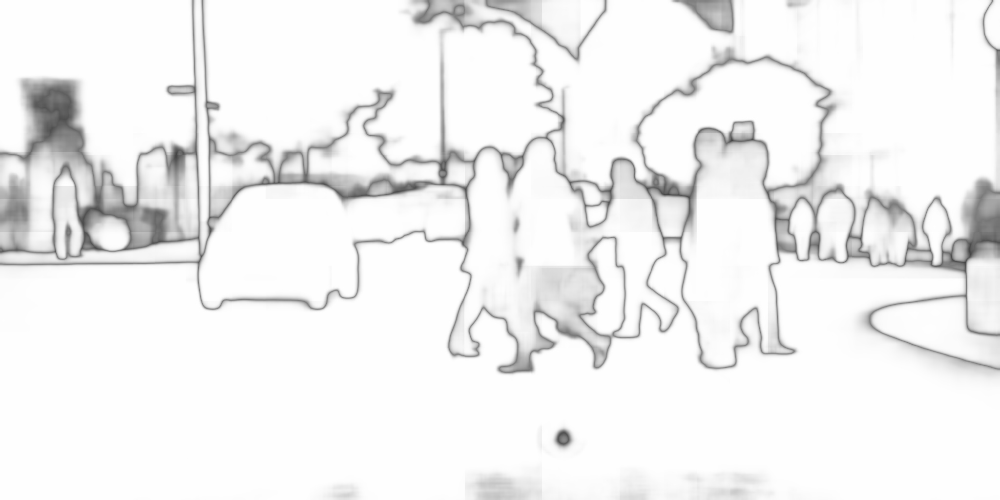
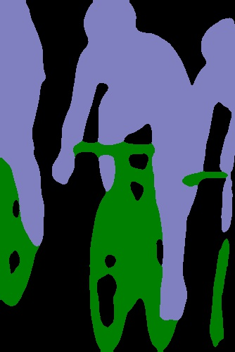
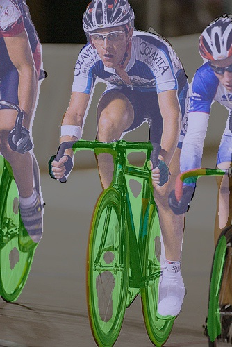
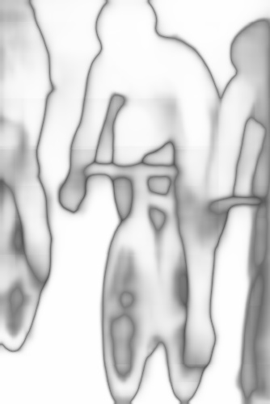

# PSPNet Tensorflow 2

Keras Pyramid Scene Parsing Network ported to tensorflow 2 from keras/tf_1.13.

- Caffe implementation: [PSPNet(caffe)](https://github.com/hszhao/PSPNet)
- Py35 Keras implementation: [PSPNet-Keras-tensorflow](https://github.com/Vladkryvoruchko/PSPNet-Keras-tensorflow)

## Pretrained weights

Pretrained weights can be downloaded here:

| H5 Weights | Architecture | Numpy Weights |
|------------|--------------|---------------|
| [pspnet50_ade20k.h5](https://www.dropbox.com/s/7eyuzmag8df41j4/pspnet50_ade20k.h5?dl=0) | [pspnet50_ade20k.json](https://www.dropbox.com/s/xy7gs4g2def5z89/pspnet50_ade20k.json?dl=0) | [pspnet50_ade20k.npy](https://www.dropbox.com/s/z8la9ugpdss8k8q/pspnet50_ade20k.npy?dl=0) |
| [pspnet101_cityscapes.h5](https://www.dropbox.com/s/oymx9ktu6zrv7vz/pspnet101_cityscapes.h5?dl=0) | [pspnet101_cityscapes.json](https://www.dropbox.com/s/pofkdnf59nbs5w0/pspnet101_cityscapes.json?dl=0) | [pspnet101_cityscapes.npy](https://www.dropbox.com/s/2tdl01ihse7p9sr/pspnet101_cityscapes.npy?dl=0) |
| [pspnet101_voc2012.h5](https://www.dropbox.com/s/lqkmukeuo78cbcs/pspnet101_voc2012.h5?dl=0) | [pspnet101_voc2012.json](https://www.dropbox.com/s/i9f2p3q1d4wohd3/pspnet101_voc2012.json?dl=0) | [pspnet101_voc2012.npy](https://www.dropbox.com/s/yp4im80m72r6h98/pspnet101_voc2012.npy?dl=0) |

Download weights in 
- `.h5` and `.json` format and place them at `weights/keras` or
- `.npy` and place them at `weights/npy`

Find example [notebook](save_and_load.ipynb) which demonstrates save and load.

## Usage:

```bash
python pspnet.py -m <model> -i <input_image>  -o <output_path>
python pspnet.py -m pspnet101_cityscapes -i example_images/cityscapes.png -o example_results/cityscapes.jpg
python pspnet.py -m pspnet101_voc2012 -i example_images/pascal_voc.jpg -o example_results/pascal_voc.jpg
```
List of arguments:
```bash
 -m --model        - which model to use: 'pspnet50_ade20k', 'pspnet101_cityscapes', 'pspnet101_voc2012'
    --id           - (int) GPU Device id. Default 0
 -s --sliding      - Use sliding window
 -f --flip         - Additional prediction of flipped image
 -ms --multi_scale - Predict on multiscale images
```
## Keras results:

















## Implementation 

* The interpolation layer is implemented as custom layer "Interp"
* Forward step takes about ~1 sec on single image
* Memory usage can be optimized with:
    ```python
    config = tf.ConfigProto()
    config.gpu_options.per_process_gpu_memory_fraction = 0.3 
    sess = tf.Session(config=config)
    ```
* ```ndimage.zoom``` can take a long time


 
